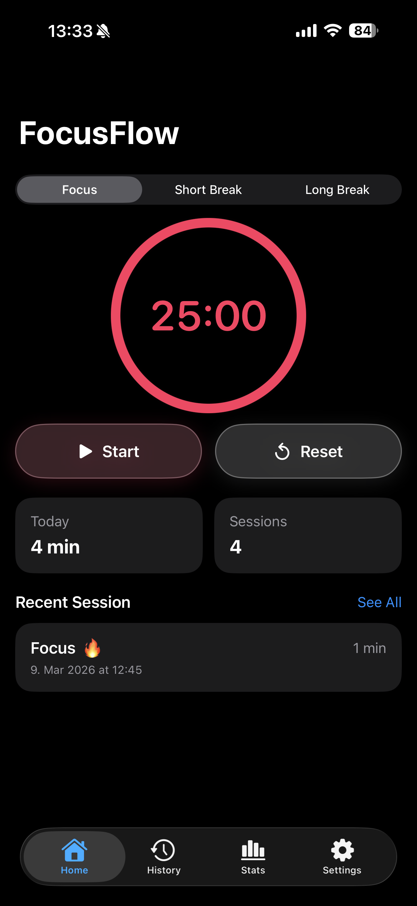
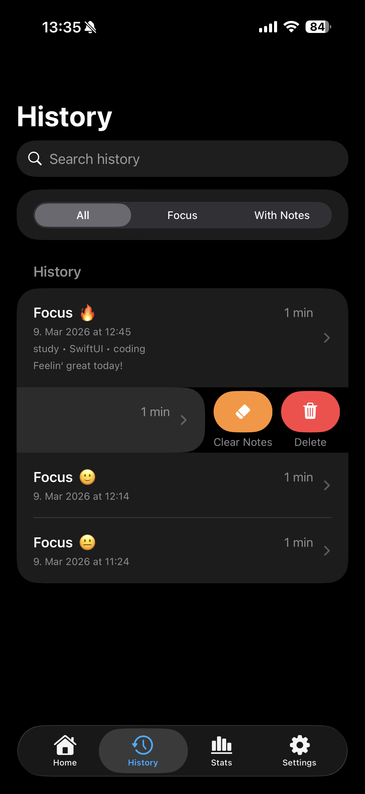
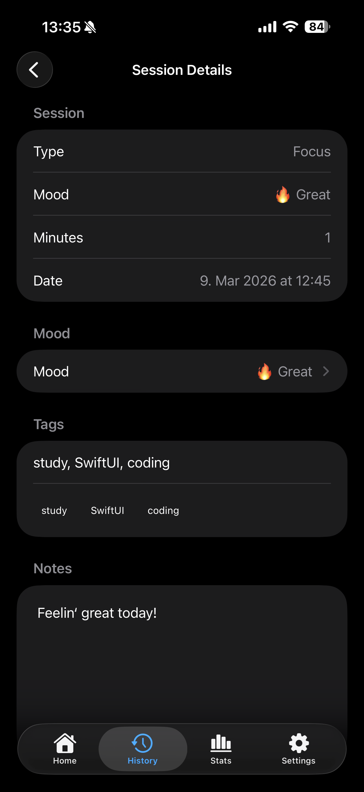
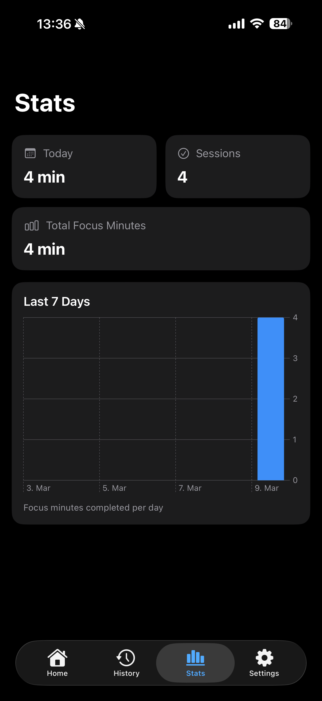
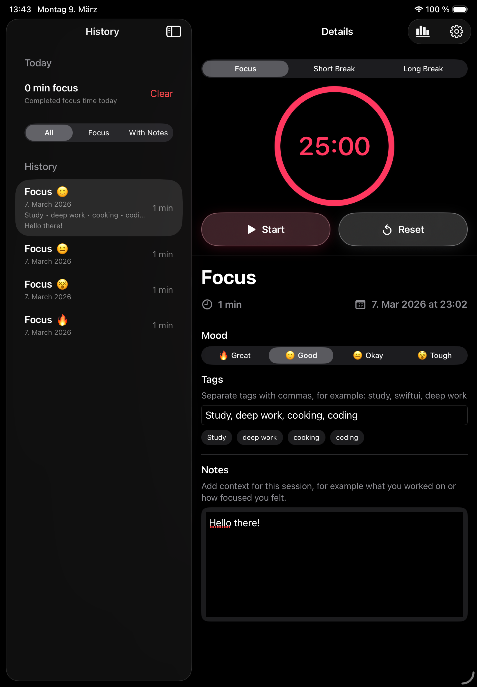

# FocusFlow

FocusFlow is a SwiftUI productivity app for iPhone and iPad that helps users manage focus sessions, review progress, and reflect on completed work.

This project was created as an iOS application sample for an apprenticeship application in software development, with a focus on clean structure, native Apple UI patterns, and practical product thinking.

## Features

- Focus / Short Break / Long Break timer
- Animated circular timer progress ring
- Session-based color changes
- Haptic feedback
- Optional automatic reset after timer completion
- Local session history
- Mood, tags, and notes for completed sessions
- Search and filter for history entries
- Statistics view with 7-day chart
- CSV import and export
- Settings with adjustable durations and app preferences
- Adaptive layouts for iPhone and iPad

## iPhone and iPad Experience

FocusFlow uses different layouts depending on the device:

- **iPhone:** tab-based navigation for Home, History, Stats, and Settings
- **iPad:** split view layout with sidebar and detail area

This allowed me to practice building interfaces that feel native on different Apple devices instead of forcing one layout onto every screen size.

## Technical Highlights

- Built with **SwiftUI**
- Uses an **MVVM-style structure**
- Local persistence via **UserDefaults**
- Charts built with **Swift Charts**
- Haptic feedback using **UIKit feedback generators**
- CSV import/export using native file handling
- Reusable custom components for buttons, timer ring, and detail views

## Why this project

The goal of this project was not just to build a timer, but to create a small product-like iOS app that demonstrates practical development skills relevant for an apprenticeship.

With FocusFlow, I wanted to show that I can work with:
	•	structured project organization
	•	reusable SwiftUI components
	•	state management
	•	persistence
	•	data visualization
	•	adaptive layouts for iPhone and iPad
	•	UI/UX decisions beyond just “making it work”

Running the project
	1.	Open FocusFlow.xcodeproj in Xcode
	2.	Select an iPhone or iPad simulator
	3.	Build and run the app

Notes
	•	The app includes a Dev Mode for faster testing
	•	Settings apply immediately
	•	Haptic feedback works best on a real device
	•	CSV import/export is intended for simple local data portability

Author

Vivien Aydin

Status

This project is intentionally scoped as a focused iOS application sample for an apprenticeship portfolio.
It is feature-complete for that purpose and demonstrates the intended development skills clearly.

## Screenshots

### iPhone





### iPad



## Project Structure

```text
FocusFlow
├── App
├── Models
├── ViewModels
├── Views
│   ├── Components
│   └── Screens
├── Resources
└── Documentation

